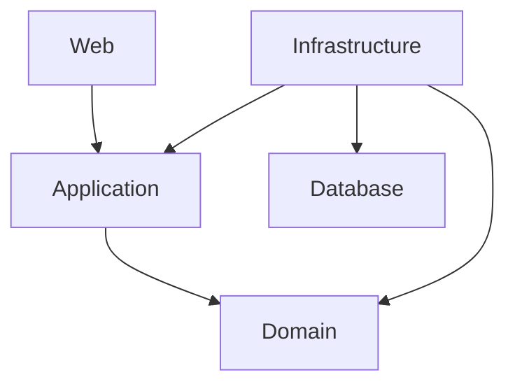
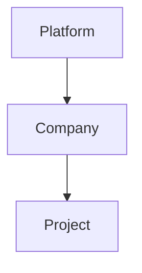
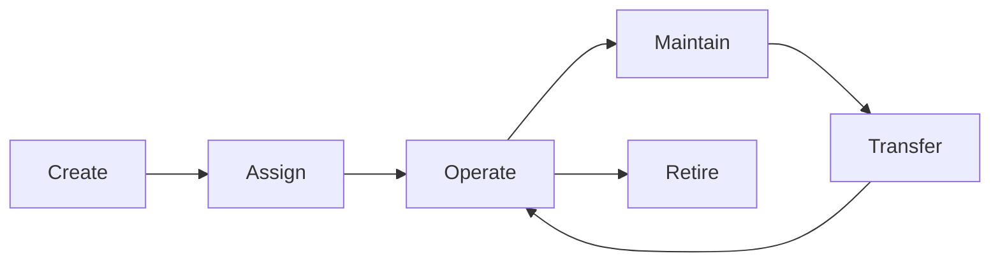

Chapter 1
# Machinery Manager Enterprise Architecture

Version: 1.0

---

# Purpose

This document defines the overall software architecture of Machinery Manager Enterprise.

It describes:

- Architectural style
- Project structure
- Layer responsibilities
- Dependency rules
- Module boundaries
- Shared components
- Coding principles

This document is the architectural contract for the entire solution.


chapter 2
# Architecture Style

The system follows:

- Clean Architecture
- Modular Monolith
- Domain Driven Design (DDD)
- CQRS
- SOLID
- Code First


chapter 3



chapter 4
```text
src
│
├── Host
│
├── BuildingBlocks
│
├── Modules
│
└── Shared
```


chapter 5
SharedKernel

SharedKernel.Abstractions

SharedKernel.Contracts

SharedKernel.Infrastructure

UI


chapter 6
Organization

Identity

Fleet

Personnel

Operation

Fuel

Overflow

Maintenance

PeriodicService

Inventory

Reporting

Notification


chapter 7
| Project        | Can Reference         |
| -------------- | --------------------- |
| Domain         | SharedKernel          |
| Application    | Domain + SharedKernel |
| Infrastructure | Application + Domain  |
| Web            | Application           |
No project is allowed to violate these dependency rules.


chapter 8



chapter 9
Company owns:

Projects

Personnel

Users

Fleet

Project owns:

Warehouse

Daily Operations

Schedules

Machine Assignment


chapter 10



